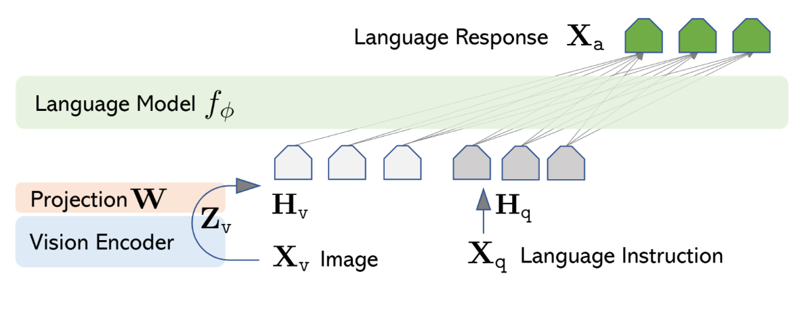
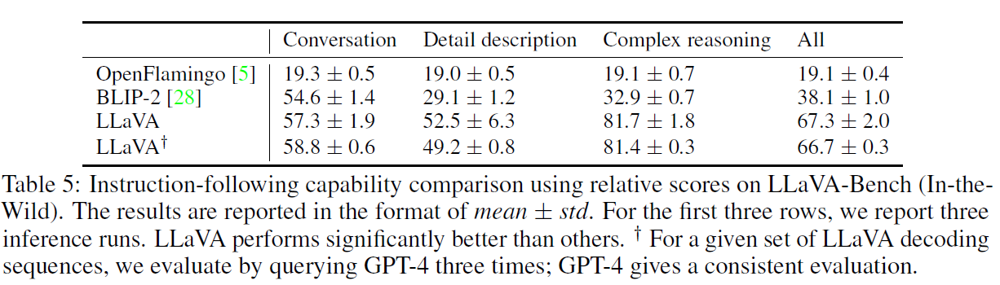

# Visual Instruction Tuning - Leveraging LLaVA for Behavioral Security Analysis

    
    

## Introduction
Behavior analysis is a complex topic. To make matters worse, it becomes increasingly more difficult when we consider incorporating computers to automate this task.
However, if we had a well-tuned, responsive, and comprehensive algorithm for performaning inference on visual data, such that it was able to determine patterns of behavior, we would then be able to more effectively moderate and protect areas of interest (schools, childrens gaming environment, airports, etc.). In this repo, using LLaVA [[Haotian et al]](papers/2304.08485.pdf) we will explore current state of the are capabilities for perfoming visual inference on human interactions.

## Background - Visual Instruction Tuning

Visual Instruction Tuning was first proposed by by [[Haotian et al]](papers/2304.08485.pdf). In this work, captions are used (with bounding-box-cooridinates and object-name paires) to exapand captions into question answer pairs. Pairing these question answer pairs with an image, an instruction following format is derived. Doing this allows for a simple linear layer to be tuned. Allowing for a latent space approximation between the visual and text encoding mechanisms. I like to think of this as two people that need to talk through an interpreter. At first, it will seem very cumbersome but after fine-tuning the single linear layer (our interpreter) the interpereter is more effective in serving the needs of the individual parties (visual encoder and text encoder). The benefits of this can be seen in the following figure detailing the quantitative results of the LLaVA model.

## Experiment

