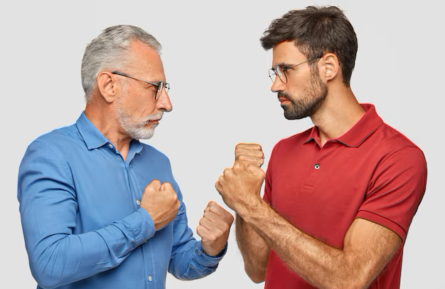

# Visual Instruction Tuning - Leveraging LLaVA for Behavioral Security Analysis
<div style="display: flex; justify-content: center; align-items: center; width: 100%;">
    
    
</div>

## Introduction
Behavior analysis is a complex topic. To make matters worse, it becomes increasingly more difficult when we consider incorporating computers to automate this task.
However, if we had a well-tuned, responsive, and comprehensive algorithm for performaning inference on visual data, such that it was able to determine patterns of behavior, we would then be able to more effectively moderate and protect areas of interest (schools, childrens gaming environment, airports, etc.). In this repo, using LLaVA [[Haotian et al]](papers/2304.08485.pdf) we will explore current state of the are capabilities for perfoming visual inference on human interactions.

## Motivation


The potential for Vision Language Models (VLM) to serve as a moderation tool and never-sleepy security gaurd is something I find very exciting. We as humans are able to ingest highly-meaningful data through our eyes. However, the amount of data we ingest through this sensor (our eyes) can result in fatigue when relied on for prolonged amounts of time.

## Background - Visual Instruction Tuning


Visual Instruction Tuning was first proposed by by [[Haotian et al]](papers/2304.08485.pdf). In this work, captions are used (with bounding-box-cooridinates and object-name paires) to exapand captions into question answer pairs. Pairing these question answer pairs with an image, an instruction following format is derived. Doing this allows for a simple linear layer to be tuned. Producing a latent space approximation between the visual and text encoding mechanisms. I like to think of this as two people that need to talk through an interpreter. At first, it will seem very cumbersome but after fine-tuning the single linear layer (our interpreter) the interpereter is more effective in serving the needs of the individual parties (visual encoder and text encoder). The benefits of this can be seen in the following figure detailing the quantitative results of the LLaVA model.


# Experiment

To use a visual language model, such as LLaVA, for detection of acts of aggression or other negative patterns of behavior exhibted by people that could pose harm to the public, we must first assess LLaVA's ability to recognized highly nuanced interpretations of human interactions. For this objective, we have set up a small scale experiment to establish the feasiblity of using these models in this manner. We want to know if the model can accurately describe three things; 1.) Description of the scene, 2.) Can if recognize a subproblem of agressive actions - touching, and 3.) can it do the heavy lifting and directly infer if a scene depicts a consensual interaction. The following will show the set up for our small scale experiment with starter code for you to expand the results if it interest and a discussion on the intial results.

## Setting Up LLaVA Inference - Experiment Set Up

```python
from transformers import LlavaNextProcessor, LlavaNextForConditionalGeneration
import torch
from PIL import Image
import requests
import os

def load_images(directory):
    image_list = []
    
    for filename in os.listdir(directory):
        file_path = os.path.join(directory, filename)

        try:
            with Image.open(file_path) as img:
                image_list.append(img.copy())
        except IOError:
            print(f"Error opening {file_path}. Skipping.")
    
    return image_list

processor = LlavaNextProcessor.from_pretrained("llava-hf/llava-v1.6-mistral-7b-hf")
model = LlavaNextForConditionalGeneration.from_pretrained("llava-hf/llava-v1.6-mistral-7b-hf", torch_dtype=torch.float16, low_cpu_mem_usage=True)
model.to("cuda:0")

imgs =load_images("experiment_photos")
question_list = ["Describe what is going on",
                "What is the person touching in this image?",
                "Is this consensual activity?"]
output_list = []
for image in imgs:
    img_question_list = []
    for q in question_list:
        prompt = f"[INST] <image>\n{q} [/INST]"
        inputs = processor(prompt, image, return_tensors="pt").to("cuda:0")
        output = model.generate(**inputs, max_new_tokens=100)
        img_question_list.append(processor.decode(output[0], skip_special_tokens=True))
    output_list.append(img_question_list)

```
## Results & Discussion


The outcome of our experiment indicates, the model is strong with detailed description of images. However, the fine resolution objectives, of making direct inferences on the scenes, may require fine-tuning or more complex prompting schemes. The ideal performance for this use case would be an output that did not shy away from the detection of violence in images. This point is further highlighted by the exceptional performance the model displayed for regular (handshake) activties.

## Conlusion

Visual language models such as LLaVA show huge potential for providing new tools for human moderation. While they may not work out of the box for specific use cases, they may be fine-tuned or prompted to provide additional performance boost. In this work we showed the following:

- Broad overview of LLaVA
- Showed how to set up LLaVA for inference
- Ran a small scale experiment to see how well LLaVA performed on describing distressing images

## Thank you for reading!
 -Adam Hooker

## Refernces
[1] Liu, Haotian, et al. "Visual instruction tuning." Advances in neural information processing systems 36 (2024).<br />
[2] Liu, Haotian, et al. "Improved baselines with visual instruction tuning." arXiv preprint arXiv:2310.03744 (2023).<br />
[3] LLaVA: Large Language and Vision Assistant, Visual Instruction Tuning." NeurIPS 2023 (Oral), llava-vl.github.io, 2023. Accessed 9 May 2024. [https://llava-vl.github.io/]
